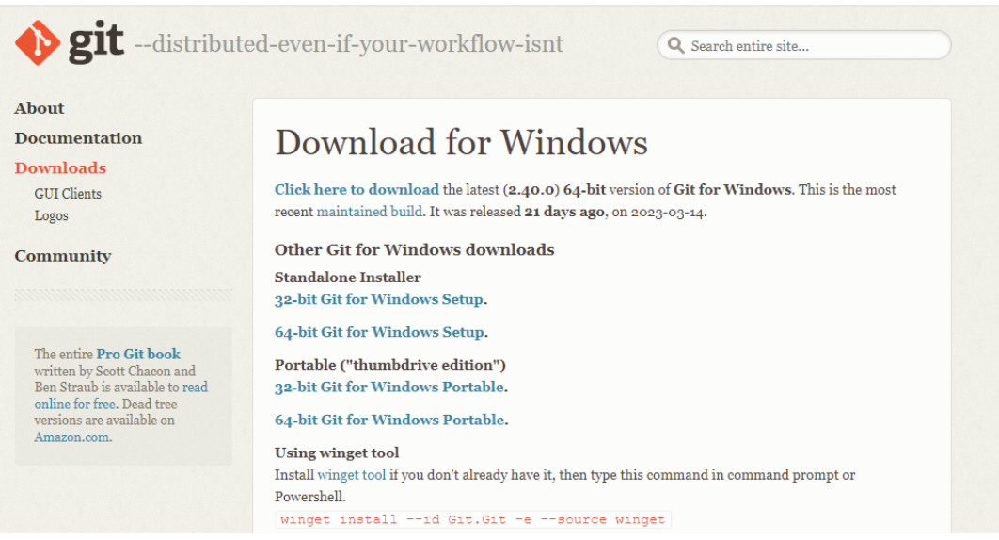
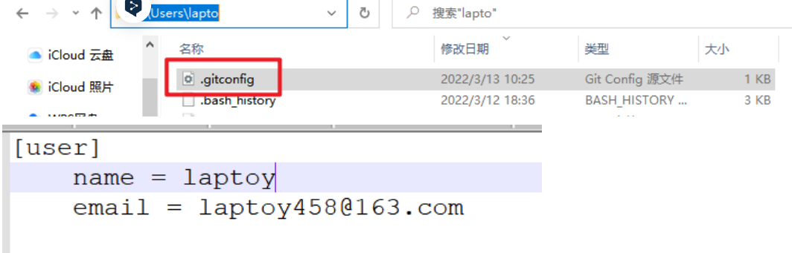

# git

一、git的安装
1、下载git
git官网地址：https://git-scm.com/download/win/
选择所需要的版本，进行下载。



2、下载完成之后，双击下载好的exe文件进行安装。


3、默认是C盘，推荐修改一下路径（非中文并且没有空格），然后点击下一步。


4、Git 选项配置，推荐默认设置，然后下一步。


5、Git 安装目录名，不用修改，直接点击下一步。


6、Git 的默认编辑器，建议使用默认的 Vim 编辑器，然后点击下一步。


7、在Git创建分支后的默认的名字（master）,如果没有特别的使用默认的设置，点击next即可。


8、修改 Git 的环境变量，使用默认的即可，点击next。


9、开启https连接，保证数据传输数据的安全，按照默认的选择即可。


10、配置 Git 文件的行末换行符，Windows 使用 CRLF，Linux 使用 LF，选择第一个自动转换，然后继续下一步。


11、选择 Git 终端类型，选择默认的 Git Bash 终端，然后继续下一步。


12、选择 Git pull 合并的模式，选择默认，然后下一步。


13、选择 Git 的凭据管理器，选择默认的跨平台的凭据管理器，然后下一步。


13、其他配置，选择默认设置，然后下一步。


14、额外的配置选项，技术还不成熟，有已知的 bug，不建议勾选，然后点击右下角的 Install按钮，开始安装 Git。


15、安装完成后，点击FInish安装完成。


二、检查
打开控制面板（win+R 输入cmd），查看Git版本信息

~~~shell
git --version
#查看命令

~~~

## 配置

## 1、配置用户名和邮箱

```shell
git config --global user.name vikytel
git config --global user.email 739029142@qq.com
```

任意位置右键点击 git bash 跳出界面后输入

name:


## 2、查看是否配置成功

1、进入该目录查看.gitconfig文件



2、命令行查看

~~~shell
git config user.name
git config user.email
~~~


注：签名的作用是区分不同操作者身份，用户的签名信息在每一个版本的提交信息中能够看到，以此确认本次提交是谁做的。Git 首次安装必须设置一下用户签名，否则无法提交代码。这里设置用户签名和将来登录 GitHub（或其他代码托管中心）的账号没有任何关系

# 什么是Git?

Git 是一个开源的分布式版本控制系统，用于敏捷高效地处理任何或小或大的项目。

Git 是 Linus Torvalds 为了帮助管理 Linux 内核开发而开发的一个开放源码的版本控制软件。

Git 与常用的版本控制工具 CVS, Subversion 等不同，它采用了分布式版本库的方式，不必服务器端软件支持。

# Git 工作流程

本章节我们将为大家介绍 Git 的工作流程。

一般工作流程如下：

- 克隆 Git 资源作为工作目录。
- 在克隆的资源上添加或修改文件。
- 如果其他人修改了，你可以更新资源。
- 在提交前查看修改。
- 提交修改。
- 在修改完成后，如果发现错误，可以撤回提交并再次修改并提交。

下图展示了 Git 的工作流程：


例如：

1.首先进入到一个仓库中，选择code，复制里面的https信息如图所示


2.通过gitbash进行如下操作：

~~~shell
##git clone HTTPS是将所复制HTTPS的仓库内容拷贝下载到当前目录
git clone https://github.com/DevelopmentZheng/python-AIbase.git
##如果远程仓库的文件发生了更新，本地仓库的文件也需要更新
git pull
##只有本地仓库和远程仓库文件一样（版本）才可以提交文件
##注意：提交文件需要远程仓库所有者授权
##将文件夹下的所有文件添加到暂存区
git add .
##将文件提交到文件本地仓库（版本库）
git commit -m "备注信息"
##将文件从本地缓冲区上传到远程仓库
git push


~~~


###  GIT工作区、暂存区和版本库

####  基本概念

我们先来理解下 Git 工作区、暂存区和版本库概念：

- **工作区：**就是你在电脑里能看到的目录。
- **暂存区：**英文叫 stage 或 index。一般存放在 **.git** 目录下的 index 文件（.git/index）中，所以我们把暂存区有时也叫作索引（index）。
- **版本库：**工作区有一个隐藏目录 **.git**，这个不算工作区，而是 Git 的版本库。

# 


# Before4

版本控制系统：记录项目被修改的状态，能够获取所有版本。

1本地版本控制系统比如RCS 

 [RCS 的](https://www.gnu.org/software/rcs/)工作原理是将补丁集（即文件之间的差异）以特殊格式保存在磁盘上；然后它可以通过添加所有补丁来重新创建任何文件在任何时间点的样子

缺点：无法和别人协同开发

2集中式版本控制系统 (CVCS)

比如svn

缺点：受制于服务器和网络，这两者出现问题，就瘫痪了

#### it

如果有任何服务器死亡，则任何客户端存储库都可以复制回服务器以恢复它，承受故障率很高。并且允许您设置集中式系统中无法实现的多种类型的工作流，例如分层模型。

### Describe3

分布式的版本控制工具。版本：项目版本，分布式：区别于之前的单人项目,是多人开发.	分布式版本控制，每一个主机都有自己独立的备份,都克隆了一份，服务器起到了一个共享和整合处理版本的中转站.

# 安装git

## mac


官网下载

更新版本或者下载最新版本，点击下面版本号，


git version 看是否安装成功

# 本地仓库

#### 管理一个文件夹，将他初始化为git仓库

命令行打开这个文件，git init

往本地仓库里面添加要被管理的文件夹或文件（这些看到的文件夹是工作区）

新建或者拖拽

#### 然后查看仓库状态

```
git status
```

Untracked files 未跟踪的文件为添加到仓库

#### 把文件添加到本地仓库

```
git add 文件名/文件夹 
git add . 所有当前文件下
```

多个文件用空格隔开，跟踪成功为绿色。这时候文件会被添加到暂存区

#### 设置git 用户名和email

```
git config --global user.name "自定义名字"只能英文，
git config --global user.email "email@邮箱"注册github 的邮箱
可以通过git config --list查看
```

#### 把文件提交到本地仓库

```
git commit -m "提交说明"
```

把添加的文件全部提交，把暂存区的文件提交到仓库，版本库中，这样就永久保存了

# 在GitHub或者gitee服务器创建远程仓库4

在网站创建账号，创建仓库

## 本地连接远程

在本地选一个要存放文件。

## 自己用ssh配置

不用重复输密码

把自己的ssh公要放到gihub网站的ssh里面

git clone ssh相关的链接

## 其他人用https

git clone https相关的链接


绑定远程仓库

```
git remote add [shortname] [url]
git remote add origin 仓库地址
git remote -v  # 查看远程关联的仓库信息
可以绑定多个仓库，同时提交多个仓库
git remote set-url --add origin  https://gitee.com/all-beings-are-equal/vedio-web-back.git
删除

```

拉取同步远程仓库信息到本地

```
git pull <远程主机名> <远程分支名>:<本地分支名>
git pull origin master:master 
可以省略成git pull origin master
如果不是克隆的，是新建的仓库一定要先拉取在提交
```

然后执行本地仓库的add,commit

然后在把本地提交到远程

```
git push -u origin master -f
加上f就强制覆盖所有分支，有时候idea不行，就用命令行
```


##### idea集git

**配置git**


查看安装的git是否有被搜索到，点击测试，即可看到


**创建仓库**

点击vcs，点击OK就可以把这个项目所在的文件初始化成git 仓库


**添加到本地仓库**


点击左侧的commit ,看到右下侧的added，就是代表被添加了，或者git status查看

然后选中文件点击提交，提交到本地仓库


这时候会出现警告，能解决的就把他解决。

可以在终端用git log 查看提交的版本

**提交到远处仓库**


把本地仓库提交到远程仓库


点击上传


点击origin 设置远程仓库的路径，或者添加


在里面填入你创建的仓库的https url，已经有不能直接添加

然后要 从远程仓库拉取一下更新到本地一下使本地具有远程的，

```
git pull origin master
```

不然会报Updates were rejected because the remote contains work that you do。不然会把远程里面有的，本地里面没有的删除掉，这是不被允许的。

不然就是用强制提交覆盖

```
有时候会出错就要用到强制提交，用命令行的方式
```

然后在点击push,提交,可以去远程仓库看看，或者

```
git log 查看修改
```

从远处拉取到本地


### 版本分支4

#### describe

创建一个和项目一样的项目也可以说是文件夹，每一个开发人员都会创建一个分支，然后去实现自己的功能，然后实现完之后在合并，这样就能在不影响别人的情况下开发自己的功能。

#### why before

都是直接用主枝，提交就直接合并了，然后就会分不清，哪部分是自己提交的，很混乱

#### why it

更加清晰的看到自己开发的部分，并且不会影响到其他人开发

#### Contain

##### 列出所有分支

```
git branch
```

##### 创建一个分支

```
git branch (branchname)
```

##### 切换分支

切换分支后，你所有的操作就是针对当前分支，相当于进入到一个同级的文件夹

```
git checkout (branchname)
git checkout -b newtest创建并直接切换
```

##### 删除分支命令

```
git branch -d (branchname)
```

##### 分支合并

必须要在主分支上

```
git merge (branchname)
```

##### 合并冲突

不同的分支修改同一个地方，合并就会产生冲突，就会显示冲突在哪里，自动合并失败，要手动合并。

处理方法，

进入产生冲突的文件


Vim runoob.php，显示如下

```
<<<<<<< HEA写的，
echo 1;
=======
echo 'runoob';是
>>>>>>> change_site
echo 1;是HEA写的，echo 'runoob';是 change_site写的
```

修改，先把三行标识删除，

```
echo 1;
echo 'runoob';是
```

保留哪一个要去跟两个作者商量，

然后退出

然后添加，提交（标记是解决冲突）

### 查看历史提交  4


```
git log
git log --oneline 简要查看
```

##### 通过作者查看

看菜鸟吧

##### 通过时间

##### 指定文件

## how to do realizate what

## application


## shortcoming


# 


